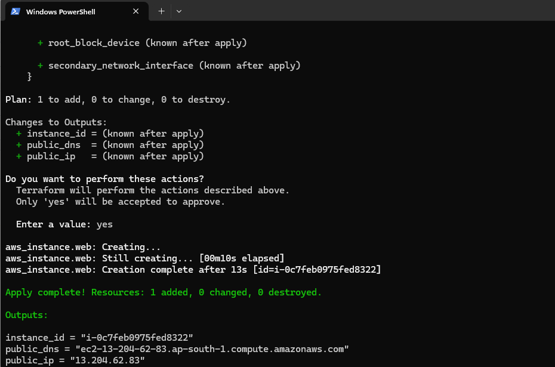
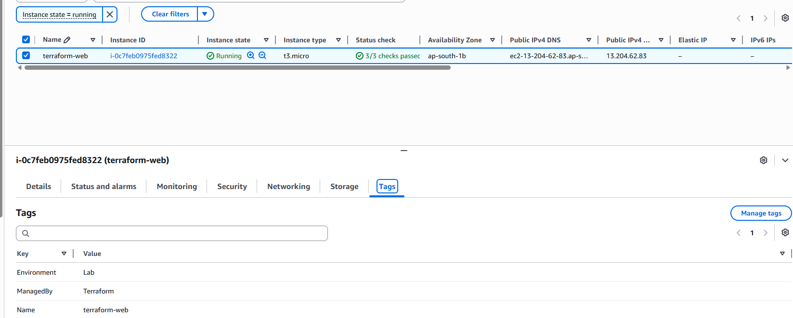
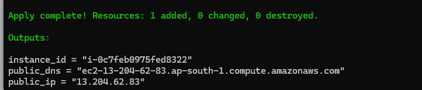

# Terraform AWS EC2 Deployment

Deploy an Amazon EC2 instance on AWS using Terraform with variables, outputs, and resource tagging.

## Overview

This project demonstrates Infrastructure as Code (IaC) using Terraform to provision an EC2 instance in AWS. It uses Terraform variables for configuration, outputs for resource information, and follows a clean project structure suitable for learning and portfolio purposes.

## Features

* Deploy AWS EC2 instance using Terraform
* Configurable through variables
* Resource tagging
* Outputs for instance details
* Version-controlled infrastructure
* Beginner-friendly Terraform project

## Project Structure

```text
terraform-aws-ec2/
├── main.tf
├── variables.tf
├── terraform.tfvars.example
├── outputs.tf
├── .gitignore
├── .terraform.lock.hcl
└── README.md
```

## Technologies Used

* Terraform
* Amazon EC2
* AWS Provider
* Git & GitHub

## Prerequisites

Before using this project, ensure you have:

* Terraform installed
* AWS account
* AWS CLI configured
* Appropriate AWS permissions to create EC2 instances

## Configuration

Create a file named:

```text
terraform.tfvars
```

Example:

```hcl
aws_region    = "ap-south-1"
ami_id        = "ami-xxxxxxxxxxxxxxxxx"
instance_type = "t3.micro"
instance_name = "terraform-web"
```

## Terraform Workflow

Initialize Terraform:

```bash
terraform init
```

Validate configuration:

```bash
terraform validate
```

Review execution plan:

```bash
terraform plan
```

Deploy infrastructure:

```bash
terraform apply
```

Refresh Terraform state:

```bash
terraform apply -refresh-only
```

Destroy infrastructure:

```bash
terraform destroy
```

## Outputs

After successful deployment Terraform displays:

* Instance ID
* Public IP Address
* Public DNS

Example:

```text
instance_id = i-xxxxxxxxxxxxxxxxx
public_ip   = xx.xx.xx.xx
public_dns  = ec2-xx-xx-xx-xx.compute.amazonaws.com
```

## Terraform Concepts Demonstrated

* Providers
* Resources
* Variables
* Outputs
* State Management
* Resource Tagging

## Screenshots

### Terraform Apply Successful

> Insert screenshot here



### AWS EC2 Instance Running

> Insert screenshot here



### Terraform Outputs

> Insert screenshot here



## Learning Objectives

This project was created to practice:

* Infrastructure as Code (IaC)
* AWS EC2 provisioning
* Terraform state management
* Terraform variables and outputs
* GitHub project organization

## Author

Pankaj

RHCSA Certified Linux Administrator

Learning AWS, Terraform, DevOps, and Cloud Infrastructure
